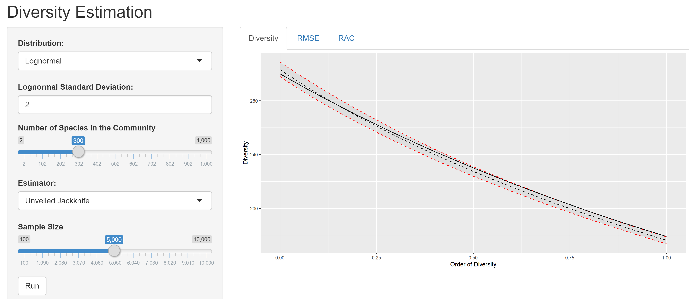

# Estimation of Diversity

A shiny application to assess the efficiency of diversity estimators applied to undersampled communities.

The theory is detailed in the paper [*Practical Estimation of Diversity from Abundance Data*](https://hal-agroparistech.archives-ouvertes.fr/hal-01212435).

Run `app.R` and choose:

- The actual community:
  - Distribution: log-normal by default.
  - Distribution parameters: standard deviation of the log-normal distribution is 2 by default.
  - Number of species: 300 by default.
- The estimator used: The unveiled jackknife by default.
- The simulation options: 10 simulations by default.

The output plots are:

- The rank-abundance curve (Whittaker plot) of the community species.
- The actual and estimated diversity profiles.
- The root mean squared error of the estimation.

